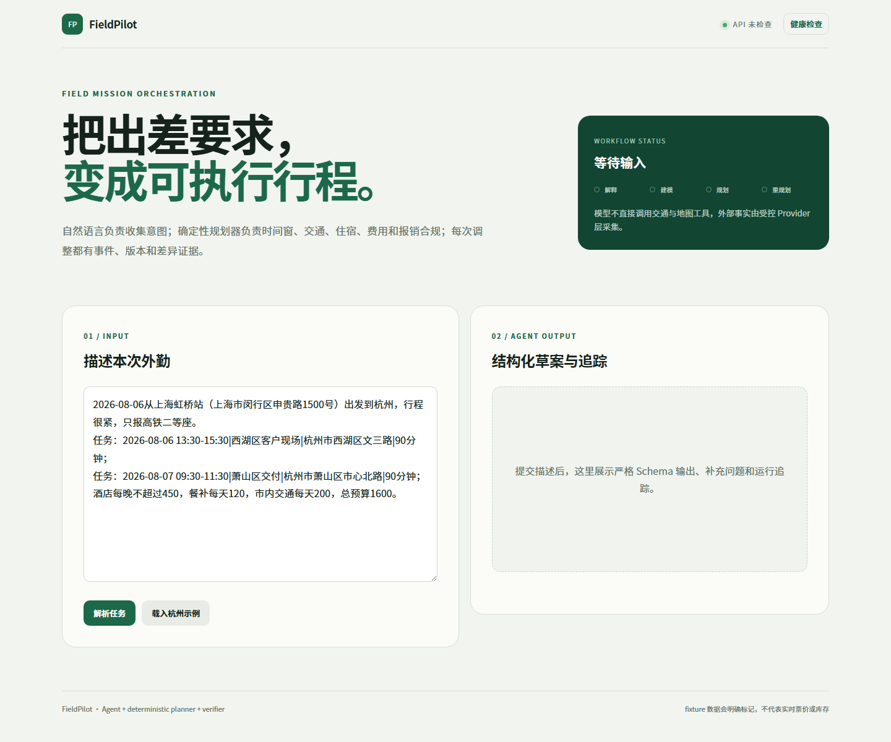

# FieldPilot｜跨城外勤任务编排 Agent

FieldPilot 面向经常跨省市出差的外勤人员，把口语描述中的地点、任务时间窗、紧密程度、交通偏好和公司报销规则转换为可验证、可比较、可动态重规划的执行方案。

**在线项目站：** [fieldpilot-kxh.netlify.app](https://fieldpilot-kxh.netlify.app/) · **在线工作台：** [fieldpilot-kxh.netlify.app/workbench](https://fieldpilot-kxh.netlify.app/workbench) · **源代码：** [github.com/KXHXK/fieldpilot](https://github.com/KXHXK/fieldpilot)

当前仓库发布版本是 `0.6.0`。类型化语义 Agent Harness 负责把自然语言安全转换为严格 MissionDraft，并治理模型契约、调用预算、确定性后置校验、幂等、审计与 Eval；确定性 Planner、Policy Engine 和独立 Verifier 负责时窗、候选、费用与报销判断。系统不会让模型编造车次、计算成本或执行购票订房。

> `0.1.0` 是已提交、可回退的技术基线，不是最终求职版本。目标 `v1.0` 将围绕真实跨城出差、任务时窗、报销约束和动态重规划重构；完整设计见 [企业级目标设计](docs/specs/2026-07-30-fieldpilot-enterprise-design.md)。在对应实现、评测和部署证据完成前，目标设计中的能力不得写成已落地事实。

当前实现已完成领域持久化、有限搜索规划、高德路线与餐饮适配及降级、Agent 解析与审计、事件驱动重规划、执行检查点、严格后缀重规划、修订差异和 Vue 工作台闭环。项目站与可写工作台部署在 Netlify，Render Docker/FastAPI 连接 Neon PostgreSQL；公网健康/就绪、完整写入 smoke、生产 CORS 与重启后持久化均已验证。公开环境仍使用 Mock LLM 与 Fixture Provider，不把合成库存或价格冒充实时数据。



## 已完成的业务闭环

```text
自然语言输入 -> Strict Contract -> PydanticAI MissionDraft
-> Deterministic Guard -> AgentRun -> 澄清 / 用户确认
-> Mission + VisitTask + ExpensePolicy 持久化
-> Candidate Provider（高德路线/餐饮、授权人工库存或显式 Fixture）
-> PolicyEngine -> Bounded Planner -> Independent Verifier
-> PlanRevision / ProviderSnapshot -> Vue 时间线与来源展示
-> ExecutionCheckpoint 锁定/完成已执行前缀
-> ReplanEvent 原子应用 -> 仅求解可变后缀 -> Revision Diff
```

已实现：

- 类型化语义 Harness：自然语言完整时生成严格草案，缺失时最多返回三组澄清问题；模型工具数为 0、请求与 Token 有上限，确定性代码重算澄清、安全标签和显式日期。
- AgentRun 只保存输入指纹、Prompt/模型版本、模式、Token、延迟、失败类别和结构化结果，不保存用户原文或模型自由文本。
- 1～7 天、1～6 个工作任务、任务时窗、优先级、交通偏好与报销上限的严格领域契约。
- 有界 Beam Search 返回最多三个方案；Policy Engine 过滤硬约束，Verifier 独立复算任务覆盖、时间重叠、费用和合规。
- 高德 v3 地理编码与 v5 市内路线/周边餐饮 POI 适配，具备异步并发、超时、有限重试、调用预算、缓存和逐能力降级。
- Planner 在工作点、交通枢纽或酒店附近的可用缓冲中安排餐次；只采用带人均消费且不超过剩余餐补的候选，Policy Engine 按自然日核算，Verifier 复查餐次、锚点、时间窗和费用。
- 计划请求、Agent 请求与业务事件分别幂等；active revision 使用乐观并发控制。
- 任务改期/取消/新增/延长、预算和偏好事件可原子应用；交通取消/不可用会排除候选，延误会平移时间并降低可靠性，高/中天气风险会分别过滤受影响任务的步行与骑行/骑行候选。
- 报销政策使用追加式不可变版本链；预算事件创建新快照，历史版本不覆盖，PlanRevision 绑定实际使用的 `policy_snapshot_id`。
- 铁路、航班与酒店支持严格 JSON Schema 的授权人工候选导入，强制标记 `manual` 并保存内容指纹；不抓取 12306 内部接口。
- 执行检查点命令使用 command ID 幂等与版本号并发控制；锁定/完成位置只能单调前进，重规划会逐段保留已执行前缀并从检查点恢复后缀求解，Verifier 再独立校验边界。
- Vue 3 + TypeScript 工作台展示 Agent trace、候选比较、执行时间线、政策判定、来源快照和重规划差异。
- SQLite 本地验证与 PostgreSQL Compose 交付配置；Alembic 迁移、健康/就绪检查和 GitHub Actions CI。

## 当前证据边界

| 能力 | 当前状态 | 验收边界 |
| --- | --- | --- |
| FastAPI + Pydantic 数据契约 | 已实现并测试 | 结构化 API 可复现 |
| PydanticAI 单 Agent + MissionDraft | 已实现结构化输出、Mock/fallback、TestModel 测试与 15 场景 Kimi K2.6 真实模型评测 | 最终 run 15/15 live；fallback 不进入真实模型指标 |
| Agent Harness | 已实现严格契约、有界调用、确定性护栏、幂等审计与版本化 Eval 门禁 | LLM 只解释语言；用户确认前无工具和业务副作用 |
| 高德 v5 市内路线适配 | 已进入规划链路并完成 MockTransport 契约/故障测试；真实密钥未复验 | 已验证适配与降级，未验证实时服务可用性 |
| 高德 v5 周边餐饮 POI | 已实现预算过滤、缓存、失败降级和来源快照；真实密钥未复验 | 无人均消费字段的 POI 不进入方案，Fixture 不冒充实时报价 |
| Vue v1 任务、方案、来源与重规划工作台 | 已实现、生产构建并部署 | 本地完整链路与公网 Agent 解析/方案创建已用真实浏览器验收 |
| Mission、不可变政策版本与计划修订持久化 | 已实现并测试 | 预算变更追加快照且历史不覆盖；SQLite 迁移已验证，Neon `0005` 待本次发布后迁移 |
| 有限搜索 Planner + Policy Engine + 独立 Verifier | 已实现；跨城、酒店和无 Key 餐饮使用明确 Fixture | 确定性规划可复现，数据模式必须随 segment 传递 |
| 计划请求幂等、revision 冲突与激活 | 已实现并测试 | 并发与重放路径已有接口测试 |
| AgentRun 审计、幂等与固定集 | 已实现输入指纹、trace 查询、5 场景 Mock 基线与独立 15 场景 live 固定集 | Mock 与 live 指标、数据集和报告分离 |
| ReplanEvent 事实应用与 Revision Diff | 已实现并测试；交通中断与天气风险进入确定性候选过滤并保存过滤快照 | 仅处理明确事件载荷，不声称已订阅实时天气或运营中断流 |
| 授权人工库存导入 | 已实现铁路/航班/酒店 JSON Schema、来源强制标记与内容指纹 | 候选由用户或授权系统提供，不代表自动同步实时库存 |
| ExecutionCheckpoint 与严格后缀重规划 | 已实现命令幂等、版本冲突、单调锁定/完成和前缀逐段一致性校验 | 只重算检查点后的可变后缀；有界搜索不声称全局最优 |
| CrewAI、LlamaIndex、Pydantic Evals | 未接入 | 当前业务不需要 |
| RAG、审批流、SSE、全局路线最优化 | 未实现 | 不属于当前已验收能力 |
| 公网项目站与在线工作台 | 已部署并完成 HTTP/CDN、SPA 路由及浏览器验证 | 根路径讲解架构，`/workbench` 调用生产 API；外部数据模式逐段标记 |
| FastAPI/PostgreSQL 公网服务 | Render Docker/FastAPI 与 Neon PostgreSQL 已部署 | health/ready、完整 R1/R2 smoke、CORS 和重启恢复均通过；免费层存在冷启动 |

## 公网项目站与在线工作台

[FieldPilot 在线项目站](https://fieldpilot-kxh.netlify.app/) 使用 Vite `showcase` 构建模式展示业务问题、Agent Harness 组成、完整运行链路、Eval 驱动修正、检查点后缀重规划和验证边界；同一构建的 [`/workbench`](https://fieldpilot-kxh.netlify.app/workbench) 连接 [Render API](https://fieldpilot-api-t7m6.onrender.com/api/health)，可实际完成任务解释、持久化、规划、执行检查点与事件式重规划。

`0.6.0` 首次生产验收使用 Netlify deploy `6a7b65c4c0df50fb6e96d2b5`，后端为 Render `0.6.0`。已验证根路径与 `/workbench` 返回 HTTPS 200、指纹化 JS/CSS 由 CDN 正确提供，CSP 只允许指定 Render API；Render 只向正式 Netlify origin 返回 CORS 许可，随机 origin 不获得许可。在线浏览器已显示 `API ok`，并完成杭州示例的解析、方案生成与激活。

## 本地运行

### 后端

```powershell
cd D:\CODEX\agent-portfolio\fieldpilot\backend
uv venv .venv
uv pip install --python .venv\Scripts\python.exe -r requirements.txt
Copy-Item .env.example .env
.\.venv\Scripts\alembic.exe upgrade head
.\.venv\Scripts\python.exe run.py
```

访问：

- OpenAPI：<http://localhost:8000/docs>
- 健康检查：<http://localhost:8000/api/health>

### 前端

```powershell
cd D:\CODEX\agent-portfolio\fieldpilot\frontend
npm install
npm run dev
```

访问 <http://localhost:5173>。Vite 开发服务器会把 `/api` 代理到本地后端。

### Docker Compose（配置已提供，本机尚未验证）

```powershell
docker compose up --build
```

浏览器访问 <http://localhost:8080>。Compose 使用 PostgreSQL，并在 API 启动前执行 Alembic 迁移。

## 杭州跨城示例

结构化示例位于 [`examples/hangzhou-mission-v1.json`](examples/hangzhou-mission-v1.json)，前端内置同场景自然语言：上海出发、杭州两日三任务、高铁二等座、酒店/餐补/市内交通和总预算约束。执行后会得到三个可解释候选方案，时间线包含工作点或酒店附近的餐次，并可修改任务时间触发 R2 与差异视图。Fixture 交通、住宿和餐饮只用于验证工程闭环，不代表实时票价、库存、酒店或餐饮报价。

## 真实模式

密钥只放在 `backend/.env` 或云平台环境变量中：

```env
USE_MOCK_LLM=false
AMAP_API_KEY=
LOCAL_ROUTE_PROVIDER=amap
MANUAL_CANDIDATE_FILE=../examples/manual-inventory-v1.json
PROVIDER_TIMEOUT_SECONDS=3.0
PROVIDER_MAX_RETRIES=1
PROVIDER_MAX_CONCURRENCY=4
PROVIDER_MAX_LIVE_CALLS=32
OPENAI_API_KEY=
OPENAI_BASE_URL=https://api.moonshot.cn/v1
MODEL_NAME=kimi-k2.6
```

浏览器交互地图使用独立的 Web JS 凭证，在 `frontend/.env` 配置：

```env
VITE_AMAP_JS_KEY=
VITE_AMAP_JS_SECURITY_CODE=
```

后端 `AMAP_API_KEY` 与浏览器 `VITE_AMAP_JS_KEY` 不是同一种 Key。`LOCAL_ROUTE_PROVIDER=fixture` 完全离线；设为 `amap` 后按路线查询真实接口，失败会保留原因并逐项降级。`MANUAL_CANDIDATE_FILE` 可选，只接受本地严格 JSON 文件并覆盖跨城交通/住宿候选；示例见 [`examples/manual-inventory-v1.json`](examples/manual-inventory-v1.json)。真实密钥完成复验前，不应声称线上高德可用。

## 验证

```powershell
cd backend
.\.venv\Scripts\python.exe -m pytest -q

cd ..\frontend
npm run build
```

当前结果（2026-08-12）：后端 `55 passed`；本地 SQLite 已完成 Alembic `20260810_0005 (head)` 升级、schema check、回退与重升；真实 Uvicorn 与 Render 公网环境均完成 R1～R5 smoke，覆盖任务改期、预算快照、交通取消、天气风险和严格前缀保护；完整工作台与项目专题两种前端生产构建成功。Kimi K2.6 的既有 15 场景最终全量 run 为 15/15 live、状态与安全标签准确率 100%、选定字段精确率 94.87%、澄清字段精确率 93.33%，每个代码版本每场景调用一次，不声明跨重复稳定率。`0.6.0` 已部署至 Neon/Render/Netlify；公开环境仍明确使用 Mock LLM 与 Fixture Provider。详细记录见 [开发日志](docs/development-log.md)。

运行中的完整 HTTP 冒烟（需要先启动后端）：

```powershell
cd backend
.\.venv\Scripts\python.exe scripts\smoke_workflow.py
```

## 项目演进

FieldPilot 的早期工程基础来自本人此前完成并部署的“智能旅行助手”，其中前后端分层和外部工具接入方式参考了 Datawhale HelloAgents 第十三章。在此基础上，FieldPilot 面向真实外勤场景重新设计了领域模型、Agent 边界、API 契约、任务与报销语义、规划验证链路及页面信息架构。

两个项目各自维护独立的代码目录、数据契约与部署配置。原旅行助手 `1.0.0` 冻结目录和 `1.0.1` 工作区保持不变，FieldPilot 的迭代记录与验证证据均在本仓库独立维护。

## 文档

- [Agent Harness 设计、完整运行过程与真实 Eval](docs/agent-harness.md)
- [架构与技术取舍](docs/architecture.md)
- [简历与面试事实口径](docs/resume-project-description.md)
- [后续迭代边界](docs/roadmap.md)
- [企业级目标设计（Target v1.0）](docs/specs/2026-07-30-fieldpilot-enterprise-design.md)
- [开发日志](docs/development-log.md)
- [Mission Interpret v1 Mock 基线报告](docs/evals/mission-interpret-v1-baseline.md)
- [Mission Interpret v1 Live 真实模型评测报告](docs/evals/mission-interpret-live-v1-report.md)
- [零成本公网部署方案](docs/deployment-free-tier.md)
- [五分钟演示与面试讲解](docs/demo-guide.md)
- [发布验收清单](docs/release-readiness.md)
