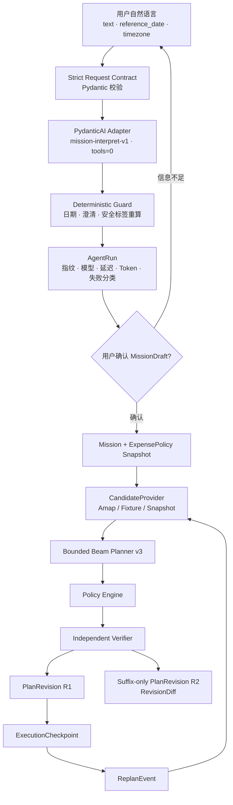

# FieldPilot Agent Harness 设计

## 1. 定位与边界

FieldPilot 的 Agent Harness 是自然语言入口的受控运行边界，不是另一个行程规划器。

它接收地点、时间、任务紧密程度和报销要求等口语输入，把不可信文本转换为可确认的 `MissionDraft`，并负责模型调用的契约、预算、失败降级、幂等、审计和评测。用户确认草案后，候选采集、时窗规划、费用合规和重规划全部由确定性业务内核完成。

因此，系统的责任分工是：

- LLM：理解语言并抽取结构化事实；
- Provider：提供带来源的外部候选与快照；
- Planner / Policy / Verifier：判断方案能否执行、是否合规；
- PostgreSQL：保存任务、修订、事件和执行位置，承担长期状态真相；
- 用户：确认语义草案，并决定何时进入有业务副作用的流程。

FieldPilot 当前不是多 Agent 系统，也没有引入 CrewAI、LangGraph、LlamaIndex、RAG 或 MCP。单个语义 Agent 已足以覆盖唯一的非确定性环节；其余职责用类型化端口、状态机和独立验证器表达，路径更短且更容易测试。

## 2. 技术架构

这条链路把“模型理解对了没有”和“方案能不能执行”拆成两个独立问题：前者由 Harness 和 Eval 管理，后者由业务约束、Provider 事实和 Verifier 管理。

## 3. Harness 组成与实际作用

| 组成 | 代码映射 | 实际作用 |
| --- | --- | --- |
| 严格输入/输出契约 | `backend/app/domain/agent.py` | 校验 `request_id`、文本、参考日期、时区和 `MissionDraft` 字段；拒绝模型自由文本直接进入业务系统。 |
| 版本化模型适配器 | `backend/app/agent/interpreter.py` | 使用 `mission-interpret-v1` Prompt 和 PydanticAI 类型化输出；`tools=()`，模型不能访问数据库、HTTP、文件或预订动作。 |
| 有界调用预算 | `MissionInterpreter`、`UsageLimits`、OpenAI-compatible client | 单次执行最多 2 次模型请求，限制总 Token；HTTP 设置超时和 1 次重试，避免无限循环与不可控费用。 |
| 确定性后置护栏 | `deterministic_postcheck()`、`complete_clarifications()` | 模型给出的澄清项和安全标签只作为建议；系统根据 typed draft 和原始输入重算缺失字段、Prompt Injection 标记及显式日期。 |
| 运行模式与降级 | `LIVE / MOCK / FALLBACK` | 公开演示不依赖密钥；真实评测只接受 `LIVE`，任何 fallback 都使质量门禁失败，避免把合成结果写成模型指标。 |
| 幂等与并发恢复 | `backend/app/services/agent_service.py` | `request_id + SHA-256 input_fingerprint` 保证安全重放；相同 ID 不同输入返回冲突；数据库唯一约束处理并发竞争。 |
| 可观测审计 | `AgentRunRecord` | 记录 Prompt/模型版本、运行模式、耗时、Token、失败类别和结构化输出；不保存用户原文或模型自由文本。 |
| 版本化 Eval 门禁 | `backend/evals/mission_interpret_live_v1.json`、GitHub Actions | 15 个固定场景覆盖完整输入、缺失信息、报销字段、时窗、单交通方式和 Prompt Injection；支持相同版本复跑。 |

## 4. 上下文管理

FieldPilot 不把无限增长的聊天记录当作业务上下文，也不需要向量库检索历史对话。

上下文按生命周期拆分：

1. **解释请求上下文**：只传入当前 `text`、`reference_date` 和 `timezone`，让相对日期有确定基准。
2. **语义上下文**：`MissionDraft` 保存任务城市、访问点、时间窗、交通偏好与报销规则；用户确认前不得触发业务动作。
3. **外部事实上下文**：Provider 查询结果持久化为 `ProviderSnapshot`，带查询指纹、来源、获取时间与过期时间，便于复盘某一版计划依据。
4. **长期业务上下文**：`Mission`、`PlanRevision`、`ReplanEvent` 与 `ExecutionCheckpoint` 记录已经确认的事实、历次方案、变化原因和已执行边界。
5. **重规划上下文**：规划器只接收当前任务快照、输入事件、Provider 候选和受保护前缀；已经锁定或完成的段不会被后续模型输出改写。

这种设计让上下文可查询、可迁移、可回放，也避免聊天摘要成为执行状态的唯一来源。

## 5. 工具与 Provider 治理

语义 Agent 的工具数固定为 0。地点路线、餐饮、铁路、航班和酒店候选只在用户确认后，由应用服务调用 `CandidateProvider` 类型化端口。

- 高德路线/餐饮适配器具备超时、重试、错误分类、缓存和来源快照；
- 铁路、航班、酒店当前使用明确标记的 Fixture，不抓取 12306 内部接口，也不冒充实时库存；
- 公开工作台使用 Mock LLM 和 Fixture Provider，真实 Kimi Eval 在独立工作流运行；
- 当前 Provider 只被 FieldPilot 后端消费，因此 Python 端口比 MCP 多一层进程与权限治理更直接。只有同一只读能力确实需要被多个 Agent 客户端复用时，才值得增加 MCP server；预订、支付和报销仍需要独立授权与人工确认。

## 6. 完整业务运行过程

1. 用户输入目的地、日期、工作任务、紧密程度、交通偏好和报销范围。
2. Harness 校验请求，通过 PydanticAI 生成严格 `MissionDraft`。
3. 确定性护栏重算日期、缺失字段与安全标记；信息不足时最多返回三组澄清问题。
4. `AgentRun` 写入审计记录；相同请求可安全重放，冲突输入会被拒绝。
5. 用户确认草案后，系统创建 `Mission`、访问任务与费用政策快照。
6. `CandidateProvider` 返回交通、住宿、餐饮和本地移动候选，并保存 `ProviderSnapshot`。
7. `bounded-beam-v3` 在有限候选空间搜索可行方案；`PolicyEngine` 检查车次等级、航班等级、酒店上限和总预算。
8. 独立 `PlanVerifier` 复算时窗、路线连续性、来源、费用和重规划不变量，通过后才写入 R1。
9. 执行期间，用户把某个交通或工作段推进为锁定/完成，形成版本化 `ExecutionCheckpoint`。
10. 任务延长、取消、改期、预算变化、交通中断或天气风险形成类型化 `ReplanEvent`。
11. 系统复用受保护前缀，只重新采集和搜索未执行后缀，生成 R2；Verifier 保证 R1 已执行部分逐段不变。
12. 工作台展示 `RevisionDiff`、来源快照、政策判断和事件链，用户可以解释为什么变、变了什么、哪些部分没有变。

## 7. 失败、降级与审计

- 模型超时、鉴权、限流和结构化输出错误使用稳定的失败分类，不向前端泄漏供应商原始错误或密钥；
- Live 模式失败可以按配置进入 fallback 以保证产品可用，但 Eval 工作流会主动失败，不把降级结果计入真实模型指标；
- Provider 返回失败时走显式 Fixture/缓存降级，并在每个 segment 上保留 `provider` 与 `source_mode`；
- 计划必须先通过独立 Verifier 才能持久化；active revision 使用乐观并发，事件与执行命令分别幂等；
- AgentRun、ProviderSnapshot、PlanRevision、ReplanEvent 和 ExecutionCheckpoint 共同形成从语言理解到执行变化的审计链。

## 8. 真实模型评测与工程结论

2026-08-01 使用 `kimi-k2.6`、固定 Prompt `mission-interpret-v1` 和 15 场景版本化数据集进行了三轮独立 Live 评测。每轮每场景调用一次，因此不声明跨重复稳定率。

| 轮次 | Live | 状态准确率 | 字段精确率 | 澄清精确率 | 安全精确率 | P50 / P95 | Token |
| --- | ---: | ---: | ---: | ---: | ---: | ---: | ---: |
| 原始真实基线 | 15/15 | 53.33% | 94.87% | 0% | 86.67% | 17.92s / 35.19s | 22,984 |
| 确定性护栏后 | 15/15 | 93.33% | 100% | 86.67% | 100% | 20.35s / 35.08s | 22,893 |
| 单一交通方式规则后 | 15/15 | 100% | 94.87% | 93.33% | 100% | 16.91s / 26.92s | 22,788 |

评测带来的实际修正：

1. 首轮暴露模型会增加无依据的澄清项和安全标签，因此将两者从“相信模型”改为确定性重算。
2. 第二轮暴露完整性规则错误地同时要求铁路和航班等级，因此改为任一允许的跨城方式具备明确等级即可。
3. 最终轮达到 15/15 Live、状态与安全 100%；仍有两处非阻断字段漏抽，因此没有把字段指标写成 100%。
4. 之后增加单日期归一化单元测试，但未重跑整套 Live Eval，因此不把该修正计入上述真实指标。

完整 run 链接、指标口径与复现方式见 [Mission Interpret v1 真实模型评测报告](evals/mission-interpret-live-v1-report.md)。

## 9. 当前诚实边界

已验证的是：51 项后端回归、Neon 迁移、Render/Netlify 公网链路、R1/R2 smoke、重启后持久化、精确 CORS，以及上述 Kimi Live Eval。

尚未验证的是：真实高德 Key 的生产运行、铁路/航班/酒店实时库存、生产限流、多租户身份隔离和 SLA。FieldPilot 展示的是可运行、可解释、可重规划的工程闭环，不声称已经具备真实下单能力或全局最优求解。
