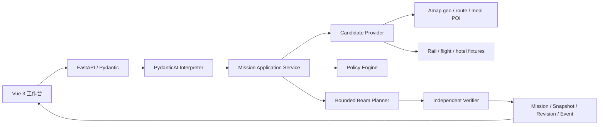

# FieldPilot 架构与技术取舍

## 1. 问题边界

FieldPilot 处理 1～7 天、1～6 个工作地点的跨城外勤：任务有时间窗和持续时间，公司政策限制交通等级、酒店、餐补、市内交通与总预算，途中变更需要留下审计并生成可比较的新版本。系统不购票、订房、叫车或提交报销。

## 2. 当前架构

Agent 只把自然语言转为 `MissionDraft` 或澄清问题，工具数固定为 0。它不接触数据库、HTTP、文件和预订动作。应用服务将已确认草案转成 Mission；Provider 采集候选；确定性规划器计算方案；Verifier 在写入修订前独立复算不变量。

## 3. 为什么只使用 PydanticAI

- 需要：类型化结构输出、模型供应商适配、请求/Token 限额与可测试的模型边界，PydanticAI 正好覆盖。
- 不需要 CrewAI Flows：当前只有一个语义 Agent，状态与恢复由数据库 Mission/Revision 状态机承担；引入角色对话只会增加不可控路径。
- 不需要 LlamaIndex：当前没有需要引用的 SOP、票据或企业知识库；为一份报销结构表建立 RAG 没有收益。
- 不引入 Pydantic Evals 包：已有版本化 JSONL/JSON 固定集和确定性评测脚本。只有需要实验矩阵、评测后端或系统化报告时才迁移。

## 4. 规划与验证

Planner 对任务顺序、跨城候选和住宿候选进行有界搜索，根据紧密程度调整迟到风险、成本、换乘、步行和政策余量权重，最多返回三个选项。行程骨架形成后，它只在任务缓冲或住宿覆盖的空闲区间中安排早/午/晚餐，优先选择当前锚点附近、带人均消费且不超过当日剩余额度的候选；找不到时保留可解释告警，不牺牲任务时间窗。它是可解释的启发式搜索，不声称全局最优。

Policy Engine 先过滤席别、舱位和单项上限，并对整单成本给出结构化判定。Verifier 不复用 Planner 的“结论”，独立检查：

- 每个任务恰好出现一次；
- 任务落在时间窗且行程段不重叠；
- 往返交通与住宿完整；
- 分类成本之和、预算余量和规则结论一致。

## 5. Provider 与真实/模拟边界

`CandidateProvider` 隔离规划器与数据源。高德适配实现地理编码、驾车/出租车、步行、骑行、公交路线，以及 v5 `/place/around` 周边餐饮 POI；路线和餐饮查询都具备异步调用、有限并发、超时、一次重试、调用预算、缓存与 in-flight 合并。餐饮只接受包含人均消费且落在剩余餐补内的 POI，缺价、高价或查询失败时不会伪造实时价格，而是记录原因并降级为冻结 Fixture。每个 segment、warning 和 ProviderSnapshot 都保留 `live / mixed / fixture` 与失败类别。

铁路、航班、酒店当前为版本固定 Fixture，不抓取 12306 内部接口，也不冒充实时库存或价格。餐饮同时具备高德真实适配路径和 Fixture 降级，但本机无真实 Key；高德路线/餐饮和 LLM 均只完成代码契约测试，尚未做公网验收。

## 6. 状态、幂等和重规划

- Agent：同一 `request_id + input_fingerprint` 重放同一 trace；不同输入冲突。
- Plan：`request_id` 只表示 API 幂等，`input_event_id` 表示业务触发源；复用 request_id 但参数不同会冲突。
- Activation：调用方提交 `expected_active_revision`，过期写入返回 409。
- Event：事件 ID、类型、基线和 payload 必须完全一致才算重放。
- Applied events：任务改期/取消/新增/延长、预算和偏好在同一事务内修改事实并保存 before/after 字段。
- Recorded-only events：天气与交通中断会留痕，但在候选过滤能力接入前不会标记为已应用。
- Revision diff：比较首选方案的稳定任务/候选身份，返回新增、删除、变化、保留段数，以及成本、评分和告警增量。

当前重规划会重新计算整个未锁定事实集合；代码会拒绝修改 locked/completed task，但尚未实现严格的“保留已执行前缀、只求解后缀”，因此文档与简历不宣称增量最优重算。

## 7. 数据与可观测性

SQLAlchemy/Alembic 管理 Mission、VisitTask、ExpensePolicy、PlanRevision、ProviderSnapshot、ReplanEvent 和 AgentRun。AgentRun 不保存自由文本原文，只保存 SHA-256 指纹、结构化输出、模型/Prompt 版本、用量、延迟和失败类别。路线与餐饮快照保存查询指纹、归一化候选、来源和安全的 HTTP 事件摘要，不保存 API Key、带 Key 的完整 URL 或原始 Provider 响应。

## 8. 交付边界

本地已验证 SQLite、42 项 Pytest、三版 Alembic 往返、运行中 HTTP 冒烟、真实浏览器主链路与 Vue 生产构建。仓库提供 PostgreSQL Compose、Nginx 反向代理、健康/就绪检查和 GitHub Actions，但当前机器没有 Docker CLI，容器运行与公网部署仍是待验证项。
