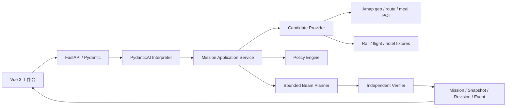

# FieldPilot 架构与技术取舍

## 1. 问题边界

FieldPilot 处理 1～7 天、1～6 个工作地点的跨城外勤：任务有时间窗和持续时间，公司政策限制交通等级、酒店、餐补、市内交通与总预算，途中变更需要留下审计并生成可比较的新版本。系统不购票、订房、叫车或提交报销。

## 2. 当前架构

Agent 只把自然语言转为 `MissionDraft` 或澄清问题，工具数固定为 0。它不接触数据库、HTTP、文件和预订动作。应用服务将已确认草案转成 Mission；Provider 采集候选；确定性规划器计算方案；Verifier 在写入修订前独立复算不变量。

这里的 Agent 特性不等于“让模型自由调用一切”：

- **目标与任务拆解**：用户目标先转成类型化 Mission、VisitTask、ExpensePolicy，再进入候选采集、规划、校验和激活状态机。
- **上下文管理**：短期语义上下文只包含本次文本、参考日期和时区；长期业务上下文由 Mission、Revision、Event、ProviderSnapshot 和 ExecutionCheckpoint 持久化。重规划读取当前事实与受保护前缀，不把整段聊天历史反复塞给模型。
- **工具边界**：模型工具集合显式为空，防止不可信文字直接触发网络或副作用。高德/Fixture 等工具由应用服务在草案确认后通过 `CandidateProvider` 类型化端口调用，具有超时、重试、并发、预算、缓存、来源和降级治理。
- **反馈闭环**：Policy Engine 和独立 Verifier 给出可解释约束反馈；现场事件形成新 Revision 与 Diff，而不是覆盖旧计划。
- **可观测与评测**：AgentRun 保存输入指纹、Prompt/模型版本、模式、Token、延迟与失败类型；Mock 回归、TestModel 契约和真实模型固定集互相分离。

## 3. 为什么只使用 PydanticAI

- 需要：类型化结构输出、模型供应商适配、请求/Token 限额与可测试的模型边界，PydanticAI 正好覆盖。
- 不需要 CrewAI Flows：当前只有一个语义 Agent，状态与恢复由数据库 Mission/Revision 状态机承担；引入角色对话只会增加不可控路径。
- 不需要 LlamaIndex：当前没有需要引用的 SOP、票据或企业知识库；为一份报销结构表建立 RAG 没有收益。
- 不引入 Pydantic Evals 包：已有版本化 JSONL/JSON 固定集和确定性评测脚本。只有需要实验矩阵、评测后端或系统化报告时才迁移。
- 不引入 MCP：当前 Provider 只由 FieldPilot 后端消费，Python 类型化端口能提供更直接的权限、超时、预算和审计边界。若同一地图/差旅能力需要被 Codex、桌面助手或多个 Agent 客户端跨进程复用，再把只读查询暴露为 MCP server；预订、支付和报销仍需单独授权与人工确认。

## 4. 规划与验证

Planner 对任务顺序、跨城候选和住宿候选进行有界搜索，根据紧密程度调整迟到风险、成本、换乘、步行和政策余量权重，最多返回三个选项。行程骨架形成后，它只在任务缓冲或住宿覆盖的空闲区间中安排早/午/晚餐，优先选择当前锚点附近、带人均消费且不超过当日剩余额度的候选；找不到时保留可解释告警，不牺牲任务时间窗。它是可解释的启发式搜索，不声称全局最优。

Policy Engine 先过滤席别、舱位和单项上限，并对整单成本给出结构化判定。Verifier 不复用 Planner 的“结论”，独立检查：

- 每个任务恰好出现一次；
- 任务落在时间窗且行程段不重叠；
- 往返交通与住宿完整；
- 分类成本之和、预算余量和规则结论一致。

## 5. Provider 与真实/模拟边界

`CandidateProvider` 隔离规划器与数据源。高德适配实现地理编码、驾车/出租车、步行、骑行、公交路线，以及 v5 `/place/around` 周边餐饮 POI；路线和餐饮查询都具备异步调用、有限并发、超时、一次重试、调用预算、缓存与 in-flight 合并。餐饮只接受包含人均消费且落在剩余餐补内的 POI，缺价、高价或查询失败时不会伪造实时价格，而是记录原因并降级为冻结 Fixture。每个 segment、warning 和 ProviderSnapshot 都保留 `live / mixed / fixture` 与失败类别。

铁路、航班、酒店当前为版本固定 Fixture，不抓取 12306 内部接口，也不冒充实时库存或价格。餐饮同时具备高德真实适配路径和 Fixture 降级，但本机无真实 Key；高德路线/餐饮和 LLM 均已具备真实调用与独立评测入口，在凭证运行证据生成前仍标记为待验收。

## 6. 状态、幂等和重规划

- Agent：同一 `request_id + input_fingerprint` 重放同一 trace；不同输入冲突。
- Plan：`request_id` 只表示 API 幂等，`input_event_id` 表示业务触发源；复用 request_id 但参数不同会冲突。
- Activation：调用方提交 `expected_active_revision`，过期写入返回 409。
- Event：事件 ID、类型、基线和 payload 必须完全一致才算重放。
- Execution：`command_id` 负责命令幂等，`expected_version` 负责乐观并发；锁定和完成边界只能沿首选时间线单调前进。
- Applied events：任务改期/取消/新增/延长、预算和偏好在同一事务内修改事实并保存 before/after 字段。
- Recorded-only events：天气与交通中断会留痕，但在候选过滤能力接入前不会标记为已应用。
- Revision diff：比较首选方案的稳定任务/候选身份，返回新增、删除、变化、保留段数，以及成本、评分和告警增量。

存在执行检查点时，Planner 以激活修订中的受保护段作为不可变前缀，从锁定段的结束时间和位置恢复搜索状态，只对后续任务、交通、住宿与餐饮进行求解。受保护任务从待规划集合移除，已锁定酒店与步行/换乘/成本状态继续传入后缀搜索；Verifier 会逐段比较前缀内容、确认恢复段存在，并拒绝任何越过检查点的后缀。该能力保证“前缀不变、后缀可重算”，但有界 Beam Search 仍是可解释启发式规划，不声称全局最优。

## 7. 数据与可观测性

SQLAlchemy/Alembic 管理 Mission、VisitTask、ExpensePolicy、PlanRevision、ProviderSnapshot、ReplanEvent、AgentRun、ExecutionCheckpoint 和 ExecutionCommand。ExecutionCheckpoint 保存来源修订、锁定/完成边界及受保护段；ExecutionCommand 保存命令指纹与结果，用于安全重放。AgentRun 不保存自由文本原文，只保存 SHA-256 指纹、结构化输出、模型/Prompt 版本、用量、延迟和失败类别。路线与餐饮快照保存查询指纹、归一化候选、来源和安全的 HTTP 事件摘要，不保存 API Key、带 Key 的完整 URL 或原始 Provider 响应。

## 8. 交付边界

本地已验证 SQLite、51 项 Pytest、Alembic `20260731_0004` 往返、运行中 HTTP 冒烟、真实浏览器执行检查点/后缀重规划链路与 Vue 生产构建。Neon `fieldpilot` 数据库已实际迁移到 head 并通过就绪查询；Kimi K2.6 已完成 15 场景真实模型评测。独立 Netlify 静态专题已上线并完成 HTTPS、SPA 回退、CDN 资源与安全响应头验证；它不连接可写后端。Render Blueprint、migration-on-start 和 CORS 已配置，公网容器仍在部署授权阶段。
