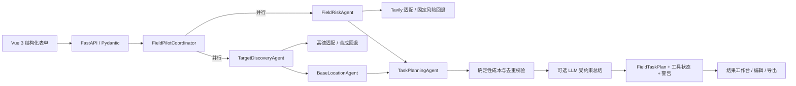

# FieldPilot 架构与技术取舍

## 1. 输入、输出与成功示例

输入是城市、执行周期、行业、目标场所类型、任务目标、预算、交通方式和驻点偏好。输出是带来源状态的目标点位、每日环境风险、驻点建议、不重复日程、成本拆分、警告和工具调用状态。

上海 3 日示例的成功条件：

1. 请求通过 Pydantic 校验，周期不超过 7 天。
2. 产生 3 个日期对应的每日方案。
3. 6 个已分配点位 ID 不重复。
4. 计划成本等于四项明细之和，并显示相对预算的余量。
5. Mock 或外部服务降级不会伪装成实时成功。
6. 前端能编辑、导出并恢复当前结果。

## 2. 当前架构

## 3. 为什么当前不引入重型编排框架

本机规划的另外三个项目原本分别包含 CrewAI Flows、LlamaIndex Workflows/Pydantic Evals、多模态检索和实验编排。FieldPilot 的今天目标是形成第二个可运行求职项目，而不是把框架名装进依赖文件。

当前流程只有一个清晰的有界 DAG：点位和风险并行收集，随后选择驻点、分配任务、计算成本、可选总结。手写 Coordinator 能直接暴露并发、失败和数据契约，测试成本最低。只有当后续出现持久化恢复、复杂路由或真实证据检索需求时，才引入对应框架。

## 4. 可靠性边界

- 外部点位和环境检索各自失败时回退，并通过 `ToolStatus.status=degraded` 告知前端。
- Mock 模式使用 `status=mock`，页面显示“非实时事实”警告。
- 高德请求超时为 8 秒；Tavily 多日期查询最多 3 个线程并发、单次 8 秒；模型客户端 15 秒超时且关闭 SDK 自动重试。
- LLM 失败不会丢失点位、风险、日程和成本。
- 点位以 `(name, address)` 去重；日程只消费去重结果，不循环复用旧点位。
- 预算和日程数值由确定性代码生成，不由模型计算。

## 5. 安全与数据

- `.env`、虚拟环境、构建产物和依赖目录不会进入版本控制。
- 示例点位是带 `synthetic` 来源标记的合成数据，不冒充真实门店。
- 模型 Prompt 只接收已结构化的计划摘要，不包含密钥，也不能触发任意工具或写操作。
- 当前没有账号、数据库、上传、审批和真实执行动作；因此也不声称具备生产 IAM、多租户或审计合规能力。
