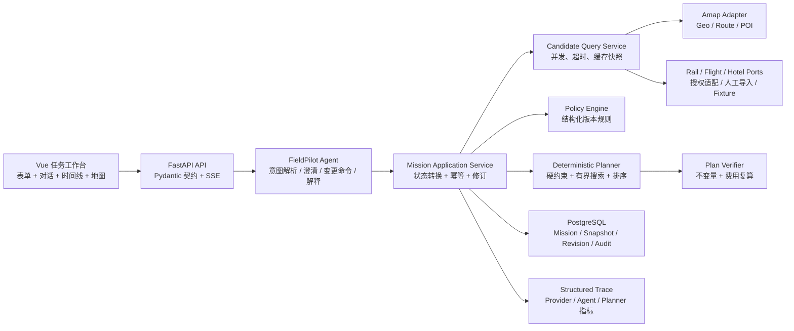

# FieldPilot｜可重规划、报销约束驱动的企业外勤任务编排 Agent

> 文档状态：目标设计（Target v1.0），不是当前 `0.1.0` 已实现事实  
> 设计日期：2026-07-30  
> 当前可回退基线：`f723221 feat: build FieldPilot field operations MVP`  
> 项目类型：个人企业级作品集项目，不虚构生产客户、真实订单量或未验证指标

## 0. 决策摘要

FieldPilot 不再定位为“搜索门店并按天分配的城市调研 Demo”，而定位为：

> 面向经常跨省市出差的外勤人员，把自然语言或结构化输入中的地点、时间窗、任务优先级、交通偏好和公司报销规则，转换为可解释、可比较、可动态重排的出差执行方案；外部信息不足或服务失败时明确降级，不替用户自动购票、订房或提交报销。

目标版本只保留对业务有直接作用的技术：

- Vue 3 + TypeScript：任务录入、时间线、地图、预算和版本差异工作台。
- FastAPI + Pydantic v2：API、领域契约、校验和供应商响应归一化。
- PydanticAI：只负责自然语言任务解析、缺失信息追问、变更指令解析和基于事实的解释。
- Python 确定性规划内核：时窗、路线可行性、费用、报销规则、候选排序和重规划。
- PostgreSQL + SQLAlchemy + Alembic：任务、政策版本、Provider 快照、计划修订和审计事件。
- 高德 Web 服务：真实地理编码、POI 和市内步行/公交/驾车路径。
- Provider Ports/Adapters：铁路、航班和住宿数据的授权适配边界；无授权数据源时使用显式 Fixture 或人工候选导入。
- Pytest + 固定场景集 + 故障注入：业务约束、Agent 解析、工具轨迹、重规划稳定性与延迟评测。
- Docker Compose + GitHub Actions + 结构化 Trace：可复现交付和可观测证据。

明确不使用：CrewAI Flows、LlamaIndex、RAG、多 Agent 自由协作、Redis、Celery/Kafka、Kubernetes。它们不是当前业务闭环的必要条件。

## 1. 审查依据与岗位映射

本设计依据以下本地材料：

- `D:\CODEX\resume\AI_Agent岗位JD简历对照摘要.md`
- `D:\CODEX\resume\DeepSeek、Kimi Code、台积电 Agent 岗位匹配审计与冲刺计划.md`
- `D:\CODEX\resume\蒯学浩_AI_Agent开发工程师_通用投递版.md`
- `D:\CODEX\resume\蒯学浩_台积电_Agent_Development_Engineer_专项简历.md`
- `D:\CODEX\agent-portfolio\opercerta`
- `D:\CODEX\个人\helloagents\helloagents-trip-planner-1.0.1`
- FieldPilot 当前 `0.1.0` 仓库与测试结果

JD 反复强调的不是“使用过多少框架”，而是从真实业务问题到工具接入、状态流程、失败恢复、评测、部署和排障的完整闭环。FieldPilot 对应关系如下：

| JD 能力 | FieldPilot 的真实证据载体 |
| --- | --- |
| LLM、Structured Output、Tool Calling | PydanticAI 将口语任务和变更解析为严格领域命令，并调用受控应用工具 |
| Agent Loop / Workflow / 状态 | 有界对话 Agent + 数据库中的 Mission/PlanRevision 状态机，不用开放式多 Agent |
| 企业 API 集成 | 高德真实适配器、铁路/航班/住宿 Provider Port、超时与降级 |
| Python/FastAPI/异步 | 独立候选查询并发、SSE 进度、取消、超时和接口契约 |
| SQL 与可靠性 | PostgreSQL 任务状态、计划修订、乐观并发、幂等事件、审计记录 |
| 评测与 Trace | 固定任务集、Provider 故障注入、约束不变量、LLM 解析和工具轨迹评测 |
| Docker/CI/CD | 本地一键启动、自动测试、迁移、健康检查和公开演示发布 |
| RAG / MCP / HITL | 由 OperCerta 深入证明；FieldPilot 不重复堆叠 |

### 与 OperCerta 的差异化

| 项目 | 核心问题 | 主要技术难点 |
| --- | --- | --- |
| OperCerta | 内部运营异常的取证、审批和安全写入 | LangGraph、MCP、RAG、HITL、Checkpoint、幂等副作用 |
| FieldPilot | 外部实时信息下的出差约束规划和途中变更 | Provider 融合、时空约束、费用政策、候选排序、增量重规划 |

两个项目共同证明完整 Agent 工程能力，但不复制相同卖点。

## 2. 当前 `0.1.0` 基线诊断

### 可以复用

- FastAPI/Vue 前后端分层、健康检查和 API 客户端。
- Pydantic 请求/响应契约。
- 高德服务端 Key 与浏览器 JS Key 分离。
- Mock / success / degraded 状态语义。
- 外部请求超时、有限并发和 LLM 失败不破坏基础结果。
- 地图、结果编辑、文本导出和打印框架。
- Docker、Netlify 配置和已有测试入口。

### 必须重写

- `industry`、`target_place_types`、商圈门店搜索等输入不是本项目核心需求。
- “四个 Agent + Coordinator”只是按模块改名，不应作为多 Agent 卖点。
- 轮询分配点位不处理交通时间、任务时窗、工作时长和换乘缓冲。
- 每晚 420 元、每日餐费 180 元等硬编码不是真实报销规则。
- Tavily 环境检索不是外勤编排的核心数据源。
- 当前计划没有持久化、版本、事件、重规划、决策理由和可回放快照。

因此升级方式是保留工程骨架，替换领域模型和规划核心，不继续扩展现有“点位调研”语义。

## 3. 目标用户、痛点与成功场景

### 目标用户

经常在不同省市执行会议、巡检、交付、调研或现场支持任务的个人外勤人员。

### 真实痛点

1. 跨城高铁/飞机、市内交通、酒店和工作地点分散在不同平台，人工拼接容易遗漏时间和换乘成本。
2. 公司对交通等级、酒店、餐补和市内交通有不同上限，低价不一定可行，可行方案也可能超标。
3. 多个工作地点具有固定或弹性时间窗，简单按距离排序可能导致迟到。
4. 客户改期、车次延误、天气变化后，人工重新排列全部行程耗时且容易破坏已确认事项。
5. 普通 LLM 能生成“看起来合理”的行程，却不能证明数据来源、约束是否满足或费用如何计算。

### 代表性成功场景

用户输入：

> 周四早上从上海出发到杭州，13:30 前到西湖区客户现场，任务 90 分钟；17:00 前到滨江区第二个现场。周五上午 9:30 去萧山区，结束后返回上海。行程很紧，公司只报高铁二等座，酒店每晚 450 元以内，餐补每天 120 元，市内交通每天 200 元，总预算 1600 元。

系统输出：

- 缺失信息追问，例如出发地址、是否允许提前一晚、任务间缓冲要求。
- 经过来源标记的跨城和市内交通候选。
- 满足全部硬约束的主方案，以及成本优先/稳妥优先备选。
- 每段出发时间、缓冲、费用、报销状态和选择理由。
- 酒店应位于哪些工作地点或交通枢纽之间，以及是否满足每晚上限。
- 餐饮只推荐工作地点或酒店附近、符合单次/每日预算的候选，不虚构实时价格。
- 当“滨江任务推迟到 18:30”时，只重算受影响的未完成后缀，保留已锁定车次和已完成任务，并展示修订前后差异。

## 4. 为什么这里需要 Agent

FieldPilot 不是因为用了 LLM 才叫 Agent，而是因为系统需要在有状态任务中持续完成“理解—调用—验证—解释—调整”的闭环。

Agent 适合承担：

- 将口语描述解析为 `MissionDraft`、`VisitTask`、`ExpensePolicyInput`。
- 识别缺失或冲突信息，并提出最少数量的澄清问题。
- 将“客户改到下午三点”“保留酒店但换返程”解析为受控 `ReplanCommand`。
- 调用只读或受控应用工具：读取任务、生成方案、比较修订、解释约束。
- 使用计划中的事实 ID 生成用户可理解的解释。

确定性代码必须承担：

- 日期、时区、时长和时间窗计算。
- 路线可行性、换乘缓冲和冲突检测。
- 交通、住宿、餐饮和总费用计算。
- 报销规则判断。
- 候选剪枝、排序、计划不变量校验和重规划范围。
- 数据库事务、幂等、并发控制和审计。

模型禁止：

- 自行编造车次、航班、酒店价格或地图耗时。
- 绕过政策引擎宣称“可报销”。
- 直接购票、订房、叫车或提交报销。
- 修改已完成或用户锁定的计划段。

## 5. 产品边界

### v1.0 必须落地

- 结构化表单与自然语言双入口。
- 1–7 天、1–6 个工作地点、固定/弹性时间窗。
- 跨城候选、地理编码、市内公交/驾车/步行/骑行路线。
- 版本化报销政策和逐项合规判断。
- 住宿驻点和就近餐饮候选。
- 主方案 + 至少两个可解释备选。
- 计划持久化、锁定、修订、差异比较和事件驱动重规划。
- 真实高德路径；铁路/航班/酒店允许使用授权 Provider、人工导入或显式 Fixture。
- 端到端可复现案例、故障注入、评测报告和公网演示。

### 明确不做

- 自动支付、购票、订房、叫车和报销提交。
- 抓取 12306 网站内部接口或绕过反爬/登录机制。
- 为了一份政策文档构建 RAG。
- 开放式多 Agent 讨论、角色扮演或无限反思。
- 生产级多租户、完整 IAM、Kubernetes 和大规模高并发声明。
- 未获得授权的真实企业政策和个人行程数据。

## 6. 总体架构



关键原则：Agent 不直接拼装最终行程。它把用户意图转成领域命令，应用服务调用 Provider、政策和规划内核，Verifier 通过后才生成计划修订。

## 7. 领域模型

### 核心实体

```text
Mission
├── origin
├── date_range / timezone
├── urgency: tight | balanced | flexible
├── preferences
├── VisitTask[]
├── ExpensePolicySnapshot
├── status
└── active_revision

VisitTask
├── task_id
├── place / coordinates
├── fixed_window | flexible_window
├── service_duration
├── priority
├── locked / completed
└── notes

PlanRevision
├── revision
├── based_on_revision
├── input_event_id
├── ProviderSnapshotRef[]
├── PlanSegment[]
├── CostLedger
├── ConstraintDecision[]
├── score_breakdown
└── status: proposed | active | rejected
```

### 计划段类型

- `intercity_transport`
- `local_transport`
- `visit`
- `lodging`
- `meal_window`
- `buffer`
- `return_trip`

每个 `PlanSegment` 必须包含时间、地点、费用、数据来源、是否锁定和生成理由；外部候选还必须包含 `provider`、`fetched_at`、`expires_at` 与 `source_mode`。

### 报销政策

政策采用版本化 YAML/JSON 或数据库结构，不使用 RAG：

```yaml
policy_id: demo-cn-v1
transport:
  rail_classes: [second_class]
  flight_classes: [economy]
  allow_flight_when_rail_hours_gte: 6
lodging:
  nightly_cap_by_city_tier:
    tier_1: 500
    tier_2: 450
meals:
  daily_cap: 120
local_transport:
  daily_cap: 200
trip_total_cap: 1600
```

计划保存政策快照而不是只保存政策 ID，保证以后规则变更时仍可解释旧方案。

## 8. 状态机与重规划

### Mission 状态

```text
draft
  -> needs_input
  -> planning
  -> ready
  -> active
  -> replan_pending
  -> active
  -> completed | cancelled
```

### 生成计划

1. Agent/表单生成严格 `MissionCommand`。
2. 校验时间、地点、政策和任务字段；缺失则进入 `needs_input`。
3. 对地理编码、跨城候选、市内路线、酒店和餐饮候选做有界并发查询。
4. 保存 Provider 原始摘要与标准化快照。
5. Policy Engine 先过滤硬性违规候选。
6. Planner 生成并排序可行方案。
7. Verifier 重新计算时间、费用和约束，不依赖 Planner 的自报结果。
8. 保存 `proposed` 修订，用户确认后激活。

### 动态重规划

`ReplanEvent` 类型：

- 任务改期、取消、新增或延长。
- 用户改变预算、交通偏好或锁定项。
- 车次/航班延误或取消。
- 天气/道路风险导致缓冲变化。

重规划规则：

1. `event_id` 唯一，重复提交返回原结果。
2. 已完成段永不修改；用户锁定段默认不修改。
3. 只失效受事件影响的 Provider 查询和未来计划后缀。
4. 在数据库事务中基于 `active_revision` 做乐观并发检查。
5. 生成新 `proposed` 修订和逐段 diff，不原地覆盖旧方案。
6. 若无可行方案，返回违反的硬约束和最小放宽建议，不让 LLM 编造折中方案。

## 9. 可解释规划算法

### 为什么暂不使用 OR-Tools

v1.0 的任务上限是 6 个地点、7 天和每类有限候选。使用有界搜索更容易解释、测试和定位错误。只有当固定评测证明搜索空间或最优性成为瓶颈时，再以相同 Planner Port 引入 OR-Tools/CP-SAT 做对照。

### 规划步骤

1. **标准化**：统一时区、坐标、金额和分钟粒度。
2. **候选剪枝**：每段只保留满足政策和基本时间条件的前 K 个候选。
3. **有界 Beam Search**：按任务时间顺序扩展状态，每层保留得分最好的有限状态。
4. **硬约束校验**：迟到、重叠、等级超标、单项超限、连接时间不足直接淘汰。
5. **软约束评分**：对剩余方案计算时间风险、成本、换乘负担、步行和政策余量。
6. **稳定排序**：相同输入和 Provider 快照必须得到相同顺序。
7. **独立复核**：Verifier 重算所有段，不复用 Planner 中间判断。

### 评分示例

所有分项归一化为 0–100，分数越低越好：

```text
tight:
  45% lateness_risk + 20% cost + 20% transfer_burden
  + 10% walking + 5% policy_margin

balanced:
  35% lateness_risk + 30% cost + 20% transfer_burden
  + 10% walking + 5% policy_margin

flexible:
  25% lateness_risk + 45% cost + 15% transfer_burden
  + 10% walking + 5% policy_margin
```

输出必须展示每个分项，不只显示一个无法解释的总分。

## 10. Provider 集成与数据真实性

### 高德：v1.0 真实接入

使用官方 Web 服务：

- 地理/逆地理编码。
- POI/周边搜索：住宿、餐饮、车站和机场。
- 公交、驾车、步行、骑行路径。
- 前端 JS 地图与服务端 Web API 使用不同 Key。

高德官方说明路径结果可能随道路、数据和算法变化，因此评测必须保存 Provider 快照，不能直接拿实时结果做不可复现的回归基线。

### 铁路/航班/酒店：Port 优先

```python
class RailProvider(Protocol):
    async def search(self, query: RailQuery) -> list[TransportCandidate]: ...

class FlightProvider(Protocol):
    async def search(self, query: FlightQuery) -> list[TransportCandidate]: ...

class HotelProvider(Protocol):
    async def search(self, query: HotelQuery) -> list[StayCandidate]: ...
```

每类能力至少有：

- `FixtureProvider`：冻结样例，用于无密钥演示和回归。
- `ManualImportProvider`：用户导入从公司差旅平台/官方渠道获得的候选。
- `AuthorizedProviderAdapter`：获得合法 API 后实现。

在没有公开、授权且稳定的 12306 开发接口前：

- 不抓取网站内部请求。
- 不把 Fixture 标成实时余票。
- 可以提供官方渠道跳转和“人工确认后锁定候选”。
- 简历只写“设计铁路 Provider 适配契约与合规降级”，不能写“已接入 12306 实时余票”。

### Provider 通用可靠性

- 每次远程请求有显式连接/读取超时。
- 只对安全的读请求做有限重试和抖动退避。
- 单 Provider 失败不抹掉其他结果。
- `live / stale / manual / fixture / unavailable` 五种来源状态必须传到前端。
- 缓存使用数据库快照和 TTL；v1.0 不为此引入 Redis。
- 日志只记录查询指纹和安全摘要，不记录密钥或完整个人行程。

## 11. Agent 设计与框架取舍

### 单 Agent，而不是四个角色 Agent

唯一 Agent：`FieldPilotAgent`。

职责：

- `interpret_mission(text) -> MissionDraft | ClarificationRequest`
- `interpret_change(text, mission_state) -> ReplanCommand`
- `compare_revisions(revision_a, revision_b) -> ComparisonRequest`
- `explain_plan(plan_facts) -> PlanExplanation`

可调用的应用工具：

- `get_mission_state`
- `submit_mission_command`
- `request_plan_generation`
- `submit_replan_event`
- `get_revision_diff`

Agent 不直接访问数据库和 Provider，不获得任意 HTTP、文件或写操作工具。

### 使用 PydanticAI 的理由

- 与现有 Pydantic 领域模型直接衔接，输入、依赖、工具参数和输出均可类型化。
- 适合结构化输出和函数工具，不需要为固定业务状态再引入一套重型编排图。
- 可以记录模型消息、工具调用、Token 和延迟，形成 Agent 评测样本。
- 与 OperCerta 的 LangGraph 项目形成互补，可在面试中解释框架边界。

### 不使用 PydanticAI 的条件

如果自然语言解析相对结构化表单没有可测收益，或真实模型适配不稳定，则正式发布允许关闭 Agent，只保留表单 + 确定性规划。项目不能为保住框架名牺牲可用性。

### 不使用其他技术

| 技术 | v1.0 不使用原因 | 将来可能引入的触发条件 |
| --- | --- | --- |
| CrewAI Flows | 没有多个自治 Agent，也没有自由协作收益 | 出现必须持久化的复杂人工证据补充和有界反证循环，并经对照证明优于当前状态机 |
| LangGraph | OperCerta 已充分展示；FieldPilot 状态固定且由数据库事务驱动 | 出现复杂循环、跨节点 Checkpoint 且手写状态机维护成本显著上升 |
| LlamaIndex/RAG | 报销规则是结构化确定性数据，不应交给检索判断 | 获得多版本政策/SOP 文档集，需要原文问答与引用时，作为独立只读解释能力加入 |
| Pydantic Evals | 初期固定用例可由 pytest + 数据集运行器完成 | 真实 Agent 用例达到可维护规模，需要多次运行、Judge 或 Span 评测时 |
| Redis | 当前数据库快照足以支撑小规模缓存和幂等 | 压测证明数据库缓存无法满足延迟或限流需求时 |
| Celery/Kafka | 计划生成是秒级有界任务 | 真实 Provider 使任务变成长作业或需要可靠异步事件消费时 |
| OR-Tools | 小规模约束可由有界搜索清楚解释 | 固定数据证明最优性/性能不足时，通过 Planner Port 做 A/B 对照 |

## 12. 数据库与 API

### 主要表

- `missions`
- `visit_tasks`
- `expense_policy_snapshots`
- `provider_snapshots`
- `planning_runs`
- `plan_revisions`
- `plan_segments`
- `replan_events`
- `decision_traces`

公开演示版为单用户模式，但表结构保留 `owner_id` 边界，不虚构完整 RBAC。

### API

```text
POST /api/v1/agent/interpret
POST /api/v1/missions
GET  /api/v1/missions/{mission_id}
POST /api/v1/missions/{mission_id}/plans
GET  /api/v1/planning-runs/{run_id}/events        # SSE
POST /api/v1/missions/{mission_id}/events
GET  /api/v1/missions/{mission_id}/revisions
GET  /api/v1/missions/{mission_id}/revisions/{revision}
POST /api/v1/missions/{mission_id}/revisions/{revision}/activate
GET  /api/v1/missions/{mission_id}/audit
GET  /api/health
GET  /api/ready
```

写接口支持 `Idempotency-Key`；激活修订携带期望的当前 revision，冲突返回 `409`。

## 13. 前端工作台

### 任务输入

- 自然语言输入和结构化表单可相互同步。
- 起点、日期、工作地点、时间窗、任务时长和优先级。
- 紧密程度、交通偏好和缓冲偏好。
- 报销政策模板或手动上限。
- 缺失信息以具体字段提示，不显示泛化“生成失败”。

### 计划结果

- 地图 + 时间线联动。
- 主方案、稳妥方案、成本方案并排比较。
- 每段的来源状态、耗时、费用、缓冲和政策状态。
- 总预算、分类预算和超标原因。
- “为什么选择”“为什么淘汰”解释。
- 数据过期、Fixture、人工录入或 Provider 降级的显著标记。

### 动态调整

- 用户输入变更，也可在时间线上取消、改期、锁定。
- 展示 revision diff：新增、删除、改时、改价和政策影响。
- 用户确认后才激活新版本。

## 14. 可靠性、安全与可观测

### 可靠性

- Provider 单独超时、并发上限、有限重试和部分结果。
- 固定 Planning Budget：Provider 数量、候选 Top-K、Beam 宽度、总运行时长和 Agent 工具步数均有上限。
- 计划写入采用事务；`event_id`、`idempotency_key` 和 revision 唯一约束防止重复。
- Provider 快照、计划修订和决策 Trace 可回放。
- LLM 不可用时，结构化表单仍可完成完整规划和重规划。

### 安全与隐私

- 密钥仅在后端环境变量中。
- 地点和时间属于敏感行程信息；日志默认脱敏，演示只用合成任务。
- Agent 仅暴露白名单工具和最小必要任务摘要。
- 自由文本按不可信输入处理，不能改变系统政策或调用任意 Provider。
- 所有真实预订行为都需要离开系统到官方/企业渠道人工完成。

### 可观测

每次规划生成统一 `trace_id`，记录：

- Agent：模型、Prompt 版本、输入/输出 Token、工具步数、结构化重试和耗时。
- Provider：名称、来源模式、查询指纹、耗时、超时/错误类型和候选数。
- Planner：剪枝数量、搜索状态数、可行方案数、得分明细和 Verifier 结果。
- API：状态码、总耗时、运行结果和降级状态。

先使用结构化日志和 OpenTelemetry；只有真正需要可视化时才部署 Collector/Jaeger，不把监控组件数量作为项目卖点。

## 15. 测试、评测与验收

### 测试金字塔

- Pydantic 模型与 Policy Engine 单元测试。
- Planner/Verifier 属性与不变量测试。
- Provider Adapter 契约测试，真实请求采用录制后脱敏快照。
- PostgreSQL 事务、幂等和 revision 冲突测试。
- Agent 结构化解析、澄清和工具白名单测试。
- FastAPI 集成测试。
- Vue 组件与 1 条浏览器端到端主路径。

### 固定场景集

发布前至少覆盖以下类别，具体数量由仓库报告给出，不能预写入简历：

- 单城市单任务。
- 跨城两日多任务。
- 固定/弹性时间窗混合。
- 预算刚好、超预算和分类额度超限。
- 铁路不可用、地图超时、酒店无候选。
- 任务取消、延期、新增和用户锁定。
- Prompt Injection、非法金额、错误日期和重复事件。

### 核心指标

- Hard Constraint Violation Rate。
- Policy Decision Accuracy。
- Feasible Plan Rate。
- Replan Preservation Rate：已完成/锁定段保持率。
- Deterministic Replay Rate：相同输入和快照结果一致率。
- Agent Schema Valid Rate、Field Extraction F1、Clarification Precision。
- Provider Error Recovery Rate。
- 端到端 P50/P95、Provider P95、Token 和单任务估算成本。

### v1.0 发布门禁

1. 固定集硬约束违规为 0；无法规划的场景必须明确拒绝并列出原因。
2. 相同任务和 Provider 快照可稳定回放。
3. 重复事件不产生重复 revision；并发激活冲突可检测。
4. 至少一个真实高德多点案例通过，其他 Provider 来源状态不冒充实时数据。
5. LLM 关闭后仍能通过结构化表单生成、保存和重规划方案。
6. 后端、前端、数据库迁移、Docker 启动和 E2E 验证通过。
7. GitHub Release、演示 URL、3–5 分钟视频、评测报告和已知限制齐全。

## 16. 智旅助手复用边界

| 智旅助手资产 | 处理方式 | 理由 |
| --- | --- | --- |
| FastAPI/Vue 分层 | 复用思路，保留 FieldPilot 独立代码 | 已验证的工程骨架 |
| Mock 开关与配置 | 重构后复用 | 支持无密钥回归和真实模式 |
| 高德 Key 分离、POI/地图代码 | 复用并扩展为 Geo/Route/Poi Adapter | 与外勤业务直接相关 |
| Kimi/OpenAI-Compatible 客户端 | 复用 Provider 兼容与超时经验 | 降低模型接入成本 |
| 部署与排障文档 | 迁移为 FieldPilot 独立交付文档 | 已有中国大陆访问经验 |
| 景点/酒店/天气/行程 Agent | 不复用 | 教程领域语义和顺序流程不匹配 |
| 旅行 `TripPlan` 类型与页面 | 不复用 | 防止只换标题的包装项目 |
| Unsplash 图片能力 | 不复用 | 对外勤决策无业务价值 |
| 未授权 12306 内部请求 | 不复用/不新增 | 合规和稳定性风险 |

## 17. 实施顺序

### Stage 0：保护基线

- 保留 `f723221` 作为回退点。
- 在独立 feature 分支进行 v1.0 重构。
- 记录当前 5 条后端测试和前端构建结果，不与未来评测混用。

### Stage 1：领域与持久化

- 新建 Mission、VisitTask、Policy、Candidate、PlanRevision 和 ReplanEvent 模型。
- PostgreSQL + SQLAlchemy + Alembic。
- 结构化表单跑通创建、读取和修订 API。

### Stage 2：确定性规划内核

- Policy Engine、候选标准化、硬约束、Beam Search、评分和 Verifier。
- 使用冻结 Provider Fixture 完成首批固定场景。

### Stage 3：真实 Provider 与降级

- 接入高德 Geo/Route/POI。
- 实现 Rail/Flight/Hotel 的 Fixture、ManualImport 和空 Authorized Adapter。
- 加入快照、来源状态、超时、重试和故障注入。

### Stage 4：单 Agent 交互

- PydanticAI 任务解析、最少澄清、变更解析和解释。
- 模型关闭时结构化路径保持完整。
- 固定 Agent 数据集和工具轨迹记录。

### Stage 5：重规划工作台

- revision、diff、锁定、激活和幂等事件。
- 地图/时间线/预算/政策/来源状态联动。
- SSE 进度、取消和可恢复错误界面。

### Stage 6：验证与发布

- 扩充固定集、真实高德复验、性能和故障报告。
- Docker Compose、CI、迁移、部署、截图和演示视频。
- 依据实际报告更新 README、作品集和简历，不提前写指标。

## 18. 简历与面试口径

### 项目标题

**FieldPilot｜可重规划、报销约束驱动的企业外勤任务编排 Agent｜个人项目**

### 完成后可形成的简历结构

以下是表达模板，不是当前可直接使用的完成声明：

1. **业务与职责**：面向跨省市多地点外勤中交通、住宿、时间窗与报销规则分散的问题，独立完成需求拆解、领域建模、Agent/规划边界、全栈开发和部署交付。
2. **架构与 Agent**：使用 PydanticAI 将自然语言任务和变更解析为类型化命令，以 FastAPI 编排高德及可插拔 Provider；LLM 只负责语义和解释，确定性引擎负责时窗、费用、合规和排序。
3. **可靠性**：通过 Provider 快照、超时降级、计划 revision、幂等事件、乐观并发和独立 Verifier，实现途中变化下的增量重规划和可审计决策。
4. **结果**：只填写固定评测、真实 Provider、P50/P95、Token/成本、测试数和部署链接能够复现的数字。

### 60 秒面试主线

> FieldPilot 源于我经常跨省市出差的真实痛点。普通旅行助手通常让模型直接生成行程，但真实外勤有任务时间窗、交通连接、报销等级和途中变更，模型不能可靠计算这些约束。我把系统拆成一个负责自然语言和变更理解的类型化 Agent、一个确定性规划与政策内核，以及高德和铁路/航班/住宿 Provider 适配层。每次规划保存数据快照、费用明细、约束判断和 revision；任务改期时只重算未完成且未锁定的后缀，并展示新旧方案差异。这样项目展示的不是多个 Agent 名称，而是 LLM、工具、业务规则、数据库、评测和部署怎样组成一个可解释闭环。

### 面试时必须能画出的主链路

```text
Vue -> FastAPI -> FieldPilotAgent -> MissionService
    -> Provider Adapters -> PolicyEngine -> Planner -> Verifier
    -> PostgreSQL Revision/Audit -> SSE/UI
```

### 必须能解释的五个取舍

1. 为什么 LLM 不计算费用和路线可行性。
2. 为什么交通/酒店/餐饮是工具或服务，而不是三个 Agent。
3. 为什么当前不用 CrewAI、LangGraph 和 RAG。
4. 为什么不抓取 12306 内部接口，以及 Provider Port 如何降低替换成本。
5. 如何证明重规划没有破坏已完成任务、预算和报销约束。

## 19. 作为其他项目的设计参考

后续个人 Agent 项目统一使用以下判断顺序：

1. 先定义可复述的真实用户、痛点、输入、输出和失败案例。
2. 区分语义不确定性与业务确定性；只有前者交给 LLM。
3. 外部系统通过 Port/Adapter 接入，Mock、快照和真实数据必须可辨认。
4. 用业务实体和状态机表达流程，不把每个模块都命名为 Agent。
5. 技术引入必须对应一个当前存在、可测试的失败模式。
6. 企业级证据来自持久化、权限边界、幂等、恢复、Trace、评测和交付，不来自依赖数量。
7. 简历数字必须能由仓库命令、评测报告、Git 提交或部署记录复现。

## 20. 最终判定

按本设计完成后，FieldPilot 可作为 OperCerta 之后的第二个核心项目，因为它同时满足：

- 来自本人真实工作场景，而不是教程题目。
- Agent 对自然语言和动态变更有不可替代的明确职责。
- 确定性规划避免 LLM 伪造时间、费用和合规结论。
- 真实地图 API、可替换 Provider 和诚实降级体现企业集成能力。
- revision、幂等、Verifier、Trace 和固定评测形成可靠性证据。
- 技术栈数量受控，每项技术都能回答“为什么需要、失败时怎样处理、怎样验证”。

在这些实现和证据形成前，项目只能表述为“目标设计/开发中”；完成发布门禁后，才能写成第二个已落地项目。
